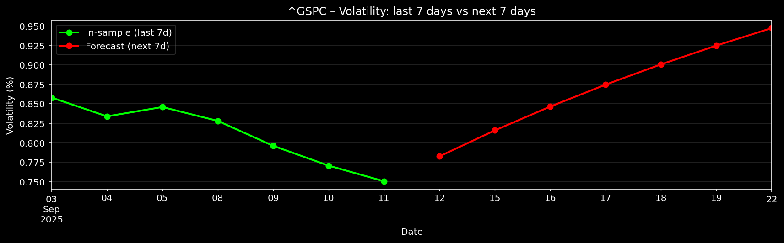

# GARCH Volatility Forecaster



Python project to forecast stock return volatility using **GARCH(p,q)** models.


## Features
- Fetches historical price data with [`yfinance`](https://pypi.org/project/yfinance/).
- Computes log returns and visualizes **ACF/PACF** for model selection.
- Fits a user-chosen **GARCH(p,q)** model with the [`arch`](https://pypi.org/project/arch/) package.
- Forecasts next N trading days of **daily volatility (%)**.
- Provides both a full in-sample vs. forecast plot, and a clarity plot (last 7 days vs. next 7 days).
- Computes a 1-day ahead backtest and uses a QLIKE evaluation, against baseline of EWMA(0.94)
- Creates a PDF to summarise results

---

## Quickstart

### 1. Clone and install
```bash
git clone https://github.com/NikolaFejsa/garch-volatility-forecast.git
cd garch-volatility-forecast
pip install -r requirements.txt
```

### 2. Run
```bash
python garch_forecast.py
```


